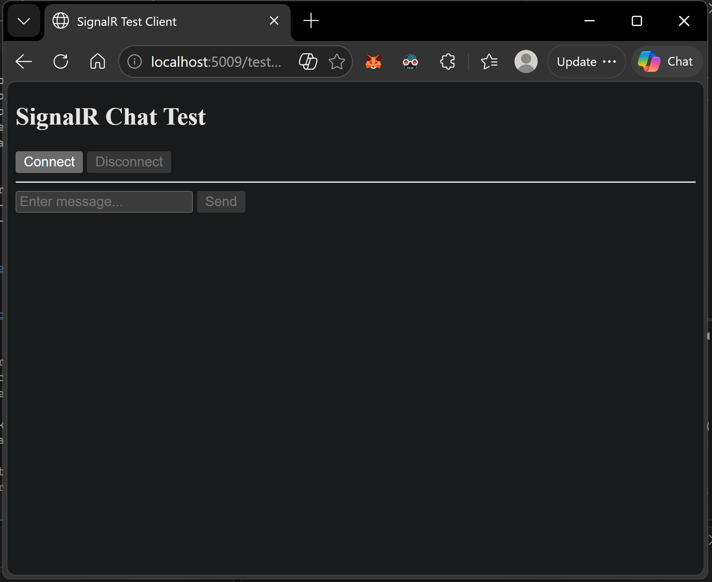
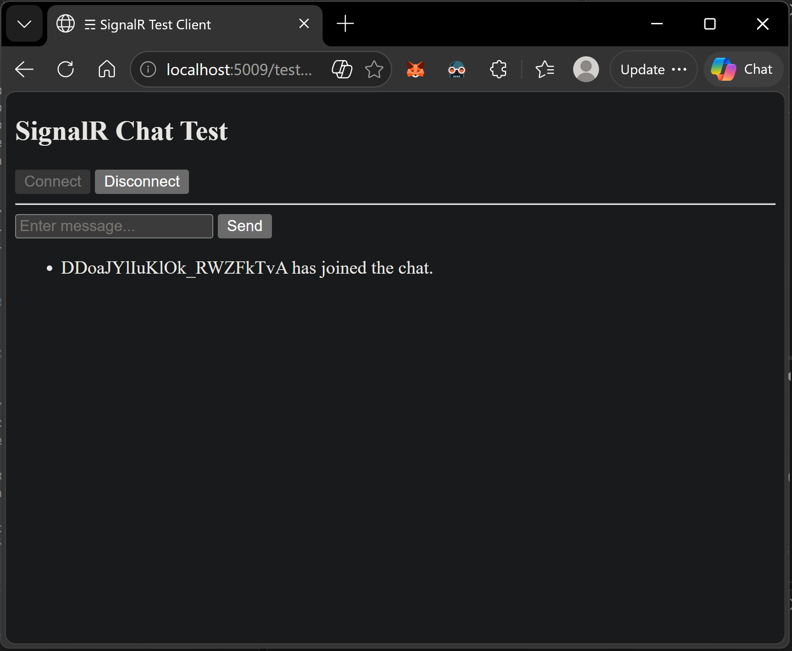
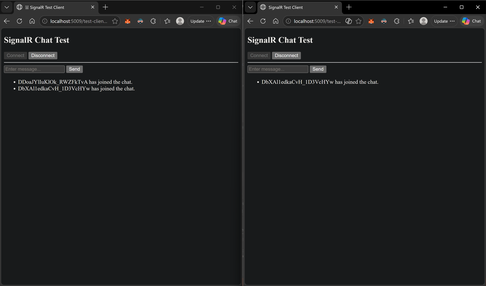
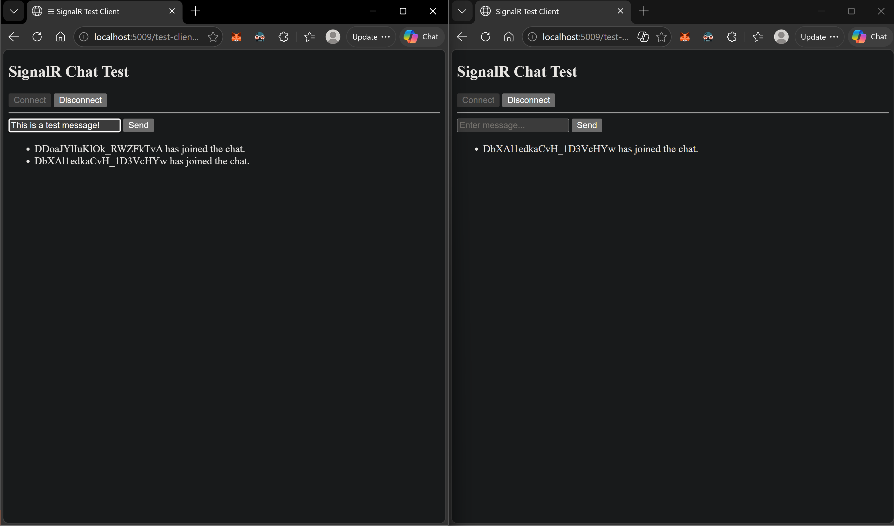
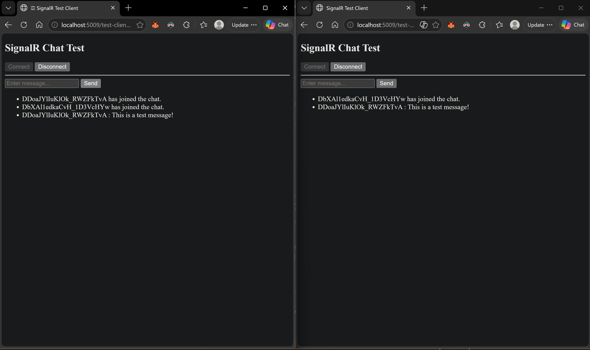
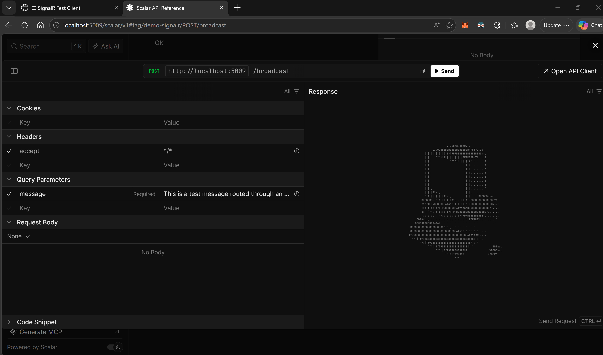
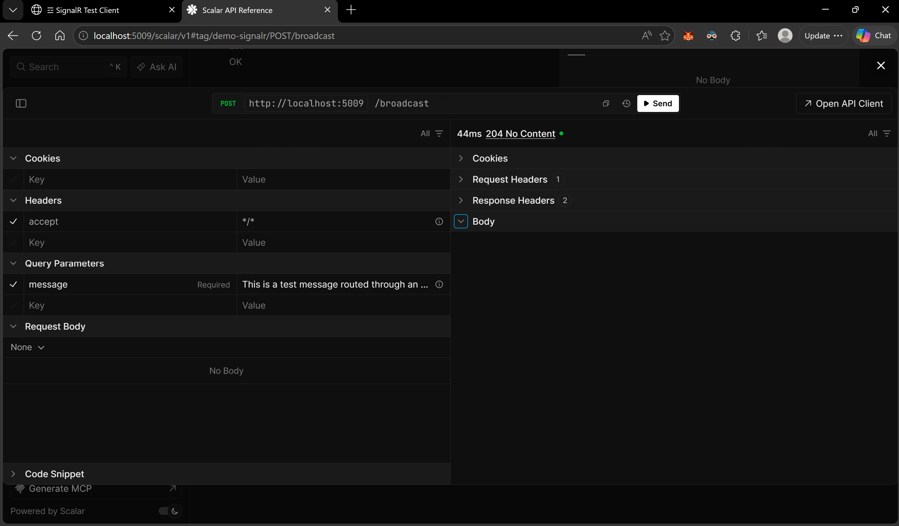
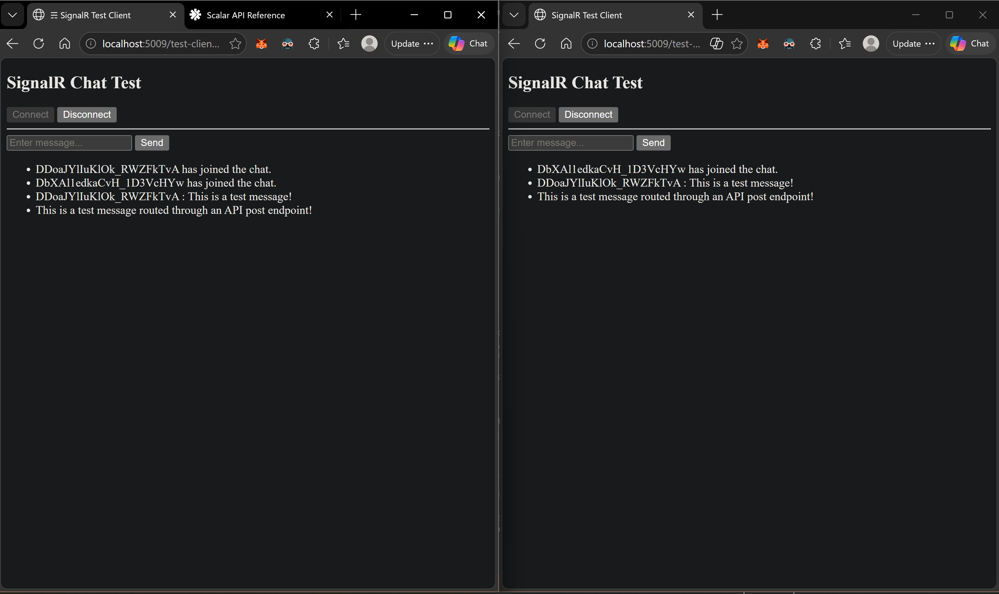
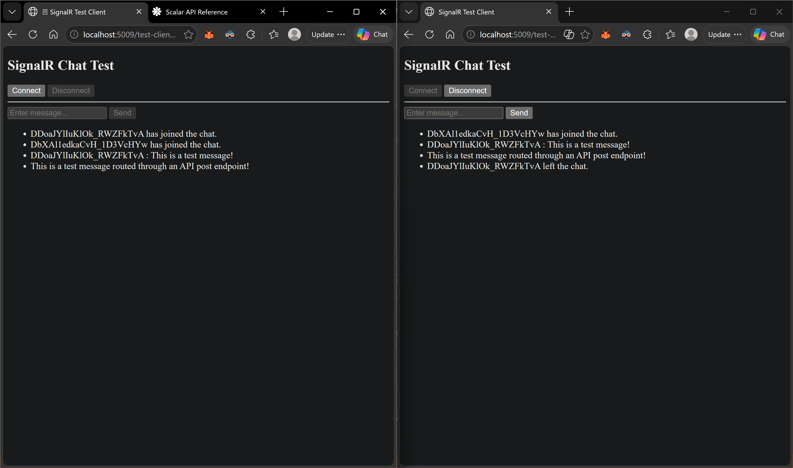

# SignalR Sample App — .NET 10.0

The purpose of this sample is to demonstrate how to use SignalR in a .NET 10.0 application.
It includes a simple web application that allows users to send messages to each other in real-time.
Users can open multiple browser windows to see real-time communication in action.
Additionally, it includes a simple API that allows users to send messages to the SignalR hub via HTTP requests and receive responses in real-time.
API documentation is available at http://localhost:5009/scalar/v1 when the application is running.

---

## Notes on SignalR

SignalR is a library for ASP.NET that allows you to add real-time web functionality to your applications.
It enables server-side code to push content to clients instantly as it becomes available, rather than having the server wait for a client to request new data.
This is particularly useful for applications that require high-frequency updates, such as chat applications, live dashboards, or gaming.

SignalR supports WebSockets, which is the most efficient transport method for real-time communication.
However, if WebSockets are not available, SignalR can fall back to other techniques such as Server-Sent Events or Long Polling to ensure that real-time communication still works.

SignalR abstracts away the complexities of managing connections and allows developers to focus on the application logic rather than the underlying communication protocols.
There is no need to worry about connection management, reconnection logic, or scaling out across multiple servers, as SignalR handles these aspects for you.

---

## Setup and Run

To update development certificates for HTTPS, run the following in the terminal:

```bash
dotnet dev-certs https --clean
dotnet dev-certs https --trust
```

Then run the application using the `http` profile:

```bash
dotnet run --launch-profile http
```

| Resource | URL |
|---|---|
| Web App UI | http://localhost:5009/test-client.html |
| Scalar API UI | http://localhost:5009/scalar/v1 |

---

## Architecture

```
┌─────────────────────┐        WebSocket        ┌──────────────────────┐
│   Browser Client A  │ ◄──────────────────────► │                      │
└─────────────────────┘                          │   ASP.NET Core App   │
                                                 │    (ChatHub)         │
┌─────────────────────┐        WebSocket        │                      │
│   Browser Client B  │ ◄──────────────────────► │                      │
└─────────────────────┘                          └──────────────────────┘
                                                          ▲
┌─────────────────────┐        HTTP POST                 │
│    API Consumer     │ ────────────────────────────────►│
└─────────────────────┘   /broadcast endpoint            │
```

---

## Code Examples

### 1. Registering SignalR (`Program.cs`)

```csharp
var builder = WebApplication.CreateBuilder(args);

builder.Services.AddOpenApi();
builder.Services.AddSignalR();
builder.Services.AddAuthorization();
builder.Services.AddAuthentication(JwtBearerDefaults.AuthenticationScheme)
    .AddJwtBearer();

var app = builder.Build();

app.MapScalarApiReference();
app.MapCustomAPIEndpoints();
app.UseStaticFiles();
app.UseAuthentication();
app.UseAuthorization();

app.MapHub<ChatHub>("/chat-hub");
app.Run();
```

### 2. Strongly-Typed Client Interface (`IMessageHub.cs`)

Using `Hub<T>` instead of `Hub` provides compile-time safety. SignalR generates a runtime proxy that implements this interface — the methods are never implemented in C#. Instead, calling them serializes the method name and arguments into a SignalR protocol message and pushes it to the connected client(s).

```csharp
public interface IMessageHub
{
    Task RecieveChatMessageAsync(string message);
}
```

### 3. The Hub (`ChatHub.cs`)

```csharp
public sealed class ChatHub : Hub<IMessageHub>
{
    public override async Task OnConnectedAsync()
    {
        await Clients.All.RecieveChatMessageAsync(
            $"{Context.ConnectionId} has joined the chat.");
        await base.OnConnectedAsync();
    }

    public override async Task OnDisconnectedAsync(Exception? exception)
    {
        await Clients.All.RecieveChatMessageAsync(
            $"{Context.ConnectionId} has left the chat.");
        await base.OnDisconnectedAsync(exception);
    }

    // Broadcast to all connected clients
    public async Task SendMessageToAllAsync(string message)
    {
        await Clients.All.RecieveChatMessageAsync(
            $"{Context.ConnectionId} : {message}");
    }

    // Broadcast to specific groups
    public async Task SendMessageToGroup(string message, IEnumerable<string> group_names)
    {
        await Clients.Groups(group_names).RecieveChatMessageAsync(message);
    }

    // Broadcast to specific users
    public async Task SendMessageToUsers(string message, IEnumerable<string> users)
    {
        await Clients.Users(users).RecieveChatMessageAsync(message);
    }
}
```

### 4. Sending Messages via HTTP API (`APIMapperExtensions.cs`)

`IHubContext<THub, T>` lets you push SignalR messages from outside the hub — useful for REST API endpoints, background services, or any non-hub code.

```csharp
// Broadcast to all clients via HTTP POST /broadcast
app.MapPost("broadcast", async (string message, IHubContext<ChatHub, IMessageHub> context) =>
{
    await context.Clients.All.RecieveChatMessageAsync(message);
    return Results.NoContent();
});

// Send to a specific authenticated user via HTTP POST /broadcast_to_user
app.MapPost("broadcast_to_user", async (
    string message,
    IHubContext<ChatHub, IMessageHub> context,
    ClaimsPrincipal claims_principal) =>
{
    string? user_id = claims_principal.FindFirstValue(ClaimTypes.NameIdentifier);
    await context.Clients.User(user_id!).RecieveChatMessageAsync(message);
    return Results.NoContent();
}).RequireAuthorization();
```

### 5. JavaScript Client (`test-client.html`)

```javascript
const connection = new signalR.HubConnectionBuilder()
    .withUrl("/chat-hub")
    .withAutomaticReconnect()
    .configureLogging(signalR.LogLevel.Debug)
    .build();

// Register handler — this is the "implementation" of IMessageHub on the client
connection.on("RecieveChatMessageAsync", message => {
    const li = document.createElement("li");
    li.textContent = message;
    document.getElementById("messages").appendChild(li);
});

// Connect
await connection.start();

// Invoke a hub method
await connection.invoke("SendMessageToAllAsync", "Hello, world!");

// Disconnect
await connection.stop();
```

> **How it works:** When the server calls `Clients.All.RecieveChatMessageAsync(...)`, SignalR sends a message with `"target": "RecieveChatMessageAsync"` over the WebSocket. The JavaScript `connection.on("RecieveChatMessageAsync", ...)` handler is the actual implementation that runs on the client.

---

## Usage Walkthrough

### Step 1 — Open the Web App

Navigate to `http://localhost:5009/test-client.html`.



---

### Step 2 — Connect a Client

Click **Connect**. The server fires `OnConnectedAsync` and broadcasts the join message to all clients.



---

### Step 3 — Open a Second Client

Open a second browser window and connect. Both clients see the new join message in real-time.



---

### Step 4 — Send a Message

Type a message and click **Send**. The hub broadcasts it to all connected clients.



---

### Step 5 — Receive the Message

Both clients receive the message in real-time via the `RecieveChatMessageAsync` handler.



---

### Step 6 — Post a Message via API

Use Scalar at `http://localhost:5009/scalar/v1` to POST to the `/broadcast` endpoint.



---

### Step 7 — API Post Succeeds

The API returns `204 No Content`, confirming the message was dispatched via `IHubContext`.



---

### Step 8 — All Clients Receive the API Message

Both browser clients receive the message pushed from the HTTP endpoint in real-time.



---

### Step 9 — Disconnect

Click **Disconnect**. The server fires `OnDisconnectedAsync` and broadcasts the leave message to all remaining clients.



---

## Additional Resource - Walkthrough

https://www.youtube.com/watch?v=DTfqqe7NgMQ

---